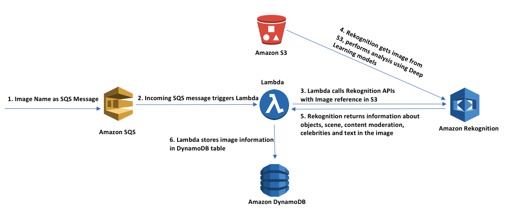

# rekognition-sqs

Using SQS as an event source, trigger a Lambda function to perform image analysis using Amazon Rekognition and write the output to a DynamoDB table.



## Using SQS as an event source to trigger Lambda

This repository contains an AWS Lambda function that uses SQS as an event source.

- An image is uploaded to a S3 bucket
- Image name is written to a SQS queue
- The SQS message triggers a Lambda function
- Lambda invokes Rekognition APIs for celebrity and text detection on that image
- Lambda writes the output to a DynamoDB table.  

### Prerequisites
- An AWS Account with permissions to IAM, CloudFormation, S3, SQS, Lambda, Rekognition, and DynamoDB.
- Install AWS CLI and configure the credentials.
- Git client  

### Steps to deploy this application
Please note:   
a. We will be using the us-east-2 region (Ohio) for deploying this application.  
b. User-specified input parameters will be marked with curly braces in the following instructions. For e.g., {s3-bucket-name} will need to be replaced with a bucket name of your choice, such as mybucketname etc.  
c. This SAM template uses inline policies. For this application to work correctly, please update the downloaded SAM template 'template.yml' with the following inline policy statements prior to executing the instructions below:  
```
		- Version: '2012-10-17'
		Statement:
		- Effect: Allow
			Action:
			- 'rekognition:DetectText'
			- 'rekognition:DetectLabels'
			- 'rekognition:DetectModerationLabels'
			- 'rekognition:RecognizeCelebrities'
			Resource: '*'  
```  

Alternatively, you may use the broader policy  
```
	- AmazonRekognitionReadOnlyAccess
```
as well.

These policies may be entered as the last entry in the 'Policies' section after  
    - SQSPollerPolicy:  
		QueueName:  !Ref QUEUENAME   

#### Steps
1. Clone this repo and change to the directory 'rekognition-sqs'.  

2. Create a S3 bucket for storing SAM deployment artifacts in the us-east-2 region. Please note that you may not use '-' or '.' in your bucket name.  
	*aws s3 mb s3://{s3-bucket-name} --region us-east-2*  

3. Create the Serverless Application Model package using CLI. The S3 bucket name is the one given in step 2 above.  
	*aws cloudformation package \  
	--region us-east-2 \  
	--template-file template.yml \  
	--s3-bucket {s3-bucket-name} \  
	--output-template-file build/packaged-template.yml*  

4. Deploy the packaged template. Enter input parameters for the S3 bucket name (given in step 3 above), DynamoDB table name, and SQS queue name (from step 2 above). This step will create a DynamoDB table, and a S3 bucket using the names specified. It will also create a Lambda function with a name starting with the {stack-name}-SQSLambda.  
	*aws cloudformation deploy \  
	--region us-east-2 \  
	--template-file build/packaged-template.yml \  
	--stack-name {stack-name} \  
	--parameter-overrides BUCKETNAME={image-bucket-name} TABLENAME={DynamoDB-table-name} QUEUENAME={SQS-queue-name} \  
	--capabilities CAPABILITY_IAM*  

5. After the stack has been successfully created, from the AWS Console for SQS add a Queue Action for the queue created in Step 4. The queue action is 'Configure Trigger for Lambda Function', and select the Lambda name starting with '{stack-name}-SQSLambda' in the drop down list.  

#### Testing the application
1. Post an image of your favorite celebrity with some text in the image, to the S3 bucket created in Step 4 as part of application deployment above.  
2. Post the image file name to the SQS queue created in Step 4 above.  
3. In few seconds you should see information about detected objects, scene, celebrities, content moderation and text in the DynamoDB table.
